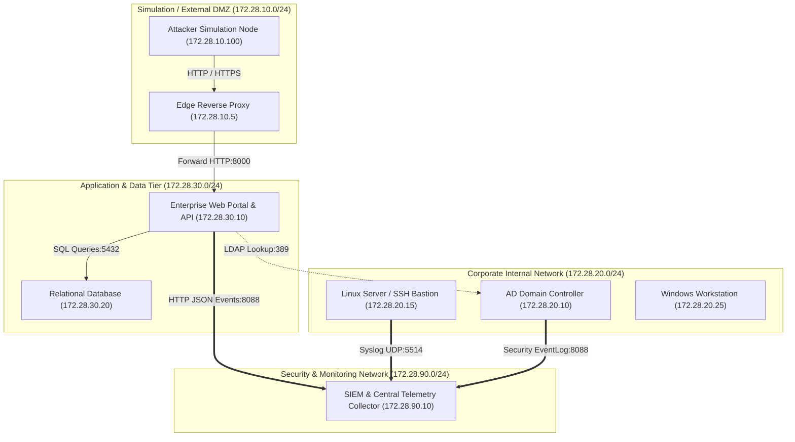

# Enterprise Attack Detection & Response Lab

[](https://python.org)
[](#)
[](#)

A reproducible, isolated enterprise security research laboratory designed for attack simulation, telemetry collection, detection engineering, and incident response automation.

---

## Target Architecture

The lab is partitioned into four isolated network zones with explicit trust boundaries:



---

## Core Features & Capabilities

- **Network Topology & Trust Boundaries**: 4 segmented subnets (`simulation_net`, `corp_internal_net`, `app_tier_net`, `secmon_net`) with automated policy validation.
- **Active Directory Infrastructure**: `CORP.ENTERPRISE.LOCAL` domain hierarchy with multi-tiered OUs, privileged administrators (`da_johnson`, `ea_miller`), service identities with SPNs (`svc_sql`, `svc_backup`), and Windows Security EventLog simulation (Event IDs 4624, 4625, 4768, 4769).
- **Linux Infrastructure**: Enterprise Linux server (`linux-srv01.corp.enterprise.local`) with SSH daemon, OpenSSH authentication tracking, and Linux auditd command execution telemetry.
- **Intentionally Vulnerable Application Tier**: Enterprise Web Portal & API with 5 documented lab vulnerabilities (SQL Injection, Command Injection, BOLA/IDOR, LDAP Injection, SSRF) emitting structured telemetry.
- **Security Monitoring & SIEM Aggregator**: High-performance SIEM ingestion engine supporting Elastic Common Schema (ECS), HTTP event ingestion (Port 8088), and Syslog UDP (Port 5514).
- **Detection Engineering Pipeline**: 30 high-fidelity Sigma-aligned detection rules spanning all 10 MITRE ATT&CK tactics with real-time alerting and AlertStore querying.
- **Attack Simulation & Detection Validation Framework**: Automated, deterministic attack scenarios mapped to MITRE ATT&CK tactics, safety containment guardrails, benign negative controls, and automated coverage matrix generation.
- **Incident Response & Investigation Engine**: Multi-source telemetry correlation across authentication, process lineage, network flows, and file activity, generating chronological timelines, extracting indicators of compromise (IOCs), and conducting automated root-cause analysis.
- **Safe Response Automation & Containment**: Auditable containment workflows including user disabling, endpoint network isolation, perimeter IOC blocking, process termination, volatile forensics collection, and rollback capabilities with strict safety guardrails.
- **Full-Lifecycle Incident Playbooks**: Pre-packaged automated playbooks for Credential Compromise, Lateral Movement, and Malware/Ransomware Data Destruction scenarios with executive and technical Markdown report generation.
- **Infrastructure as Code (IaC)**: Declarative `docker-compose.yml` and modular Terraform configurations (`terraform/`).
- **Tooling & Automation**: Unified CLI (`cli.py`), automated health checks (`scripts/healthcheck.py`), isolation validation (`scripts/validate_isolation.py`), bootstrap (`scripts/bootstrap.sh`), and teardown (`scripts/teardown.sh`).

---

## Quickstart Guide

### 1. Bootstrap the Laboratory
```bash
python3 cli.py bootstrap
```
Or directly:
```bash
./scripts/bootstrap.sh
```

### 2. Check Lab Status and Topology
```bash
python3 cli.py status
```

### 3. Run Automated Attack Simulations
```bash
# Run all attack scenarios and benign controls
python3 cli.py simulate

# Run a specific scenario
python3 cli.py simulate --scenario SCN-CRED-001

# Run only offensive attack scenarios
python3 cli.py simulate --attack

# Run only benign false-positive validation controls
python3 cli.py simulate --benign
```

### 4. Generate Detection Coverage Report
```bash
# Output ASCII Coverage Matrix
python3 cli.py coverage

# Output JSON Coverage Report
python3 cli.py coverage --json
```

### 5. Inspect Detection Rules and Alerts
```bash
# List all 30 detection rules
python3 cli.py detections

# Query generated alerts
python3 cli.py alerts
```

### 6. Automated Investigation & Incident Response
```bash
# Run automated investigation on an attack scenario
python3 cli.py investigate --scenario SCN-CRED-004

# Execute full incident response playbooks
python3 cli.py respond --playbook credential
python3 cli.py respond --playbook lateral
python3 cli.py respond --playbook malware

# View response action audit trail
python3 cli.py audit --limit 50
```

### 7. Run Automated Health Checks & Validation
```bash
# Run health checks
python3 cli.py health

# Validate network isolation and security boundaries
python3 cli.py validate
```

### 8. Run the Complete Test Suite
```bash
python3 cli.py test
```
Or:
```bash
python3 -m pytest -v
```

### 9. Clean Teardown
```bash
python3 cli.py teardown
```

---

## Project Structure

```
SOC/
├── LICENSE                       # MIT License
├── cli.py                        # Unified lab CLI
├── docker-compose.yml            # Multi-network Docker Compose infrastructure
├── docker/                       # Container Dockerfiles and configs
│   ├── Dockerfile.ad
│   ├── Dockerfile.app
│   ├── Dockerfile.linux
│   ├── Dockerfile.siem
│   └── nginx.conf
├── docs/                         # Architecture and technical documentation
│   ├── ad_structure.md
│   ├── architecture.md
│   ├── attack_simulation.md
│   ├── detection_engineering.md
│   ├── incident_response_guide.md
│   ├── logging_architecture.md
│   ├── network_diagram.md
│   └── vulnerabilities.md
├── pyproject.toml                # Build system & pytest configuration
├── requirements.txt              # Pinned dependencies
├── scripts/                      # Management and verification scripts
│   ├── bootstrap.sh
│   ├── healthcheck.py
│   ├── teardown.sh
│   └── validate_isolation.py
├── src/                          # Core source code
│   ├── core/                     # Configuration, topology, logging
│   ├── detection/                # MITRE detection rules, engine, alert store
│   ├── infra/                    # Active Directory and Linux server modules
│   ├── response/                 # Incident models, investigation engine, automation, playbooks
│   ├── siem/                     # SIEM collector, ECS models, event store, parsers
│   ├── simulation/               # Attack simulation framework, scenarios, runner
│   └── vulnapp/                  # Vulnerable enterprise portal & API
├── terraform/                    # Infrastructure as Code modules
│   ├── main.tf
│   ├── variables.tf
│   ├── outputs.tf
│   ├── terraform.tfvars.example
│   └── modules/
└── tests/                        # Comprehensive test suite
    ├── unit/
    └── integration/
```

---

## Security Guidelines

This lab is created solely for defensive security research and education.
- All intentionally vulnerable components reside strictly inside the isolated application tier.
- No real secrets, cloud API keys, or production credentials are used.
- Adheres strictly to project engineering standards, security isolation guidelines, and architectural policies.

---

## License

This project is licensed under the MIT License - see the [LICENSE](file:///home/yasaman/SOC/LICENSE) file for details.
