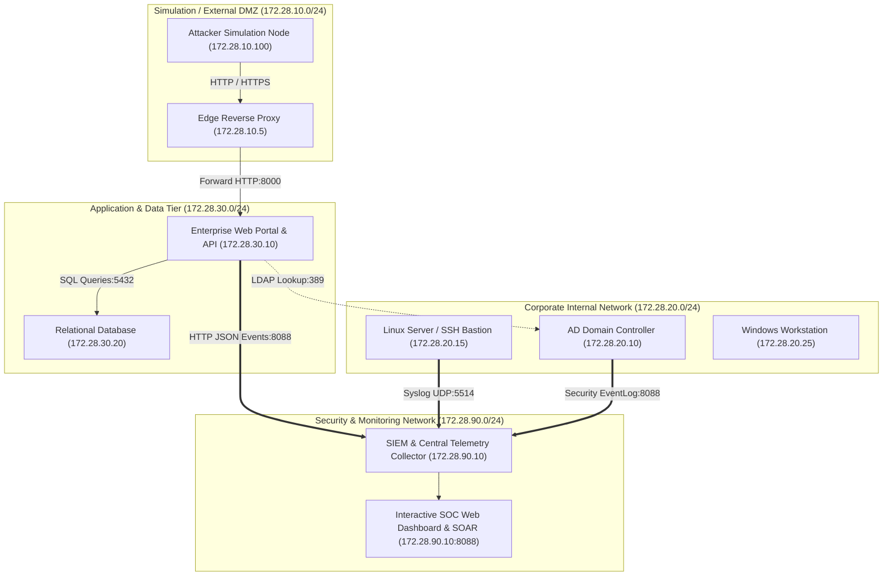

# Enterprise Attack Detection & Response Lab

[](https://python.org)
[](#)
[](#)
[](#)
[](LICENSE)

A reproducible, production-grade enterprise security research platform designed for realistic cyber attack simulation, telemetry collection, Sigma-aligned detection engineering, automated incident response (SOAR), and live SOC monitoring.

---

## Architecture Overview

The lab is partitioned into four isolated network zones with strict trust boundaries:



---

## Core Capabilities

- **Interactive SOC Web Dashboard**: High-aesthetic single-page console (`http://localhost:8088/dashboard`) with real-time telemetry metrics, MITRE ATT&CK heat grid, alert triage feed, incident workbench, and live subsystem diagnostics.
- **Guided Investigation UX**: Structured 7-step analyst lifecycle:
  `Alert` ➔ `Incident` ➔ `Timeline` ➔ `Evidence` ➔ `MITRE ATT&CK` ➔ `Response` ➔ `Resolution`
- **Live SOC Metrics Engine**: Derives real operational metrics (Mean Time to Detect, Mean Time to Respond, Detection Rate, False Positive Rate, MITRE Coverage Score, and Composite System Health).
- **Multi-Format Incident Reporting**: Synthesizes 12-section incident response reports in Markdown, JSON, and self-contained styled HTML.
- **Detection Engineering Pipeline**: 30 high-fidelity Sigma-aligned detection rules spanning all 10 MITRE ATT&CK tactics with real-time alerting.
- **Attack Simulation & Detection Validation**: 24 deterministic attack scenarios and 6 benign negative controls ensuring 100% detection coverage and 0% false positives.
- **Automated Incident Response (SOAR)**: Multi-source log correlation, automated root-cause analysis, account disablement, host network isolation, IP blocking, and reversible action rollback.
- **Deep Health Diagnostics**: Live operational checks verifying all 7 infrastructure and security subsystems.

---

## Quickstart Guide

### 1. Start the SIEM Collector & Web Dashboard
```bash
python3 cli.py serve --port 8088
```
Open your browser to: **`http://localhost:8088/dashboard`**

### 2. View Terminal SOC Dashboard & Metrics
```bash
# Terminal SOC dashboard
python3 cli.py dashboard

# Operational security metrics
python3 cli.py metrics
```

### 3. Run Attack Simulations & MITRE ATT&CK Coverage
```bash
# Run all simulation scenarios
python3 cli.py simulate

# Simulate a specific scenario (e.g. LSASS Memory Dump)
python3 cli.py simulate --scenario SCN-CRED-004

# Generate full MITRE ATT&CK coverage report
python3 cli.py coverage
```

### 4. Execute Automated Investigation & Incident Response Playbooks
```bash
# Investigate attack scenario
python3 cli.py investigate --scenario SCN-CRED-004

# Execute incident response playbooks
python3 cli.py respond --playbook credential
python3 cli.py respond --playbook lateral
python3 cli.py respond --playbook malware

# Review immutable SOAR audit trail
python3 cli.py audit
```

### 5. Generate Multi-Format Incident Reports
```bash
# Terminal Markdown report
python3 cli.py report --format md

# Export printable HTML report
python3 cli.py report --format html --output incident_report.html

# Export structured JSON report
python3 cli.py report --format json --output incident_report.json
```

### 6. Run System Health Checks & Automated Test Suite
```bash
# Execute deep diagnostics across all 7 subsystems
python3 cli.py health

# Validate network segmentation and firewall isolation
python3 cli.py validate

# Run the complete test suite
python3 -m pytest -v
```

---

## Complete Documentation Suite

Detailed technical documentation is available in the [`docs/`](docs/) directory:

- [Demonstration & Portfolio Guide](docs/demonstration_guide.md): Step-by-step reproduction walkthrough.
- [Target Architecture](docs/architecture.md): Subnet zoning, trust boundaries, and telemetry topology.
- [Threat Model](docs/threat_model.md): STRIDE threat modeling and asset classification.
- [MITRE ATT&CK Coverage Matrix](docs/mitre_coverage.md): Complete mapping of 30 detection rules across 10 tactics.
- [Detection Engineering Reference](docs/detection_engineering.md): Rule definitions and Sigma mapping.
- [Incident Response Guide](docs/incident_response_guide.md): Investigation correlation engine and SOAR playbooks.
- [Centralized Logging Architecture](docs/logging_architecture.md): ECS normalization schemas.
- [Testing & Quality Assurance Guide](docs/testing_guide.md): Test execution and validation scripts.
- [Troubleshooting & Operations](docs/troubleshooting.md): Port conflicts and operational diagnostics.
- [Future Improvements & Roadmap](docs/future_improvements.md): Distributed streaming, eBPF, and LLM co-pilot roadmap.
- [Security Assumptions & Invariants](docs/security_assumptions.md): Safety guardrails and trust invariants.
- [Known Limitations](docs/known_limitations.md): Technical trade-offs and virtualization scope.

---

## Project Structure

```
SOC/
├── LICENSE                       # MIT License
├── cli.py                        # Unified lab CLI (dashboard, simulate, respond, report, serve)
├── docker-compose.yml            # Multi-network Docker Compose infrastructure
├── docker/                       # Container Dockerfiles and configs
├── docs/                         # Comprehensive engineering documentation
│   ├── architecture.md
│   ├── demonstration_guide.md
│   ├── detection_engineering.md
│   ├── future_improvements.md
│   ├── incident_response_guide.md
│   ├── known_limitations.md
│   ├── logging_architecture.md
│   ├── mitre_coverage.md
│   ├── security_assumptions.md
│   ├── testing_guide.md
│   ├── threat_model.md
│   └── troubleshooting.md
├── pyproject.toml                # Build system & pytest configuration
├── requirements.txt              # Pinned dependencies
├── scripts/                      # Management and verification scripts
│   ├── bootstrap.sh
│   ├── healthcheck.py
│   ├── teardown.sh
│   └── validate_isolation.py
├── src/                          # Core source code
│   ├── core/                     # Configuration, topology, metrics, health, logging
│   ├── detection/                # MITRE detection rules, engine, alert store
│   ├── infra/                    # Active Directory and Linux server modules
│   ├── response/                 # Incident models, investigation, SOAR automation, reporting
│   ├── siem/                     # SIEM collector, dashboard, ECS models, event store
│   ├── simulation/               # Attack simulation framework, scenarios, runner
│   └── vulnapp/                  # Vulnerable enterprise portal & API
├── terraform/                    # Infrastructure as Code modules
└── tests/                        # Comprehensive test suite (unit and integration)
    ├── unit/
    └── integration/
```

---

## Security Guidelines

This lab is created solely for defensive security engineering research and education.
- All intentionally vulnerable components reside strictly inside the isolated application tier.
- No real secrets, cloud API keys, or production credentials are used.
- Network boundaries strictly isolate the lab from public networks.

---

## License

This project is licensed under the MIT License - see the [LICENSE](LICENSE) file for details.
