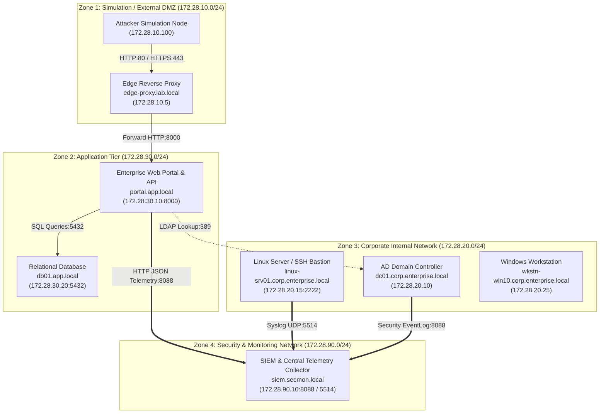

# Enterprise Lab Network Diagram & Firewall Policy

## 1. Network Topology Diagram

---

## 2. IP Allocation and Subnet Matrix

| Zone Name | Subnet CIDR | Gateway | Trust Level | Key Hosts / Roles |
| :--- | :--- | :--- | :--- | :--- |
| **Simulation External** | `172.28.10.0/24` | `172.28.10.1` | `UNTRUSTED` (0) | `edge-proxy` (`172.28.10.5`), Attacker Nodes (`172.28.10.100+`) |
| **Corporate Internal** | `172.28.20.0/24` | `172.28.20.1` | `INTERNAL_TRUSTED` (50) | `dc01` (`172.28.20.10`), `linux-srv01` (`172.28.20.15`), `wkstn-win10` (`172.28.20.25`) |
| **Application Tier** | `172.28.30.0/24` | `172.28.30.1` | `SEMI_TRUSTED_APP` (10) | `portal` (`172.28.30.10`), `app-db` (`172.28.30.20`) |
| **Security Monitoring** | `172.28.90.0/24` | `172.28.90.1` | `SECURITY_MANAGEMENT` (100) | `siem-collector` (`172.28.90.10`) |

---

## 3. Firewall Policy Rules Matrix

| Rule ID | Source Zone | Destination Zone | Port | Protocol | Action | Purpose / Traffic Description |
| :--- | :--- | :--- | :--- | :--- | :--- | :--- |
| **FW-01** | `simulation_external` | `app_tier` | `8000` | TCP | `ALLOW` | Permit external simulation access to the enterprise web portal via proxy. |
| **FW-02** | `app_tier` | `app_tier` | `5432` | TCP | `ALLOW` | Permit web application to communicate with backend database. |
| **FW-03** | `app_tier` | `corp_internal` | `389` | TCP | `ALLOW` | Permit portal authentication queries against Active Directory LDAP. |
| **FW-04** | `app_tier` | `secmon` | `8088` | TCP | `ALLOW` | Forward application audit logs to SIEM HTTP ingestion endpoint. |
| **FW-05** | `corp_internal` | `secmon` | `5514` | UDP | `ALLOW` | Forward Linux and AD syslog/audit logs to SIEM collector. |
| **FW-06** | `simulation_external` | `corp_internal` | `ANY` | ANY | `DENY` | **Default Deny**: Prevent external nodes from accessing corporate internal subnet. |
| **FW-07** | `simulation_external` | `secmon` | `ANY` | ANY | `DENY` | **Default Deny**: Prevent external tampering with security monitoring stack. |
| **FW-08** | `app_tier` | `corp_internal` | `2222` | TCP | `DENY` | Isolate Linux server SSH administrative interface from application tier. |
| **FW-09** | `ALL` | `ALL` | `ANY` | ANY | `DENY` | **Implicit Default Deny** for all unspecified inter-zone traffic. |
